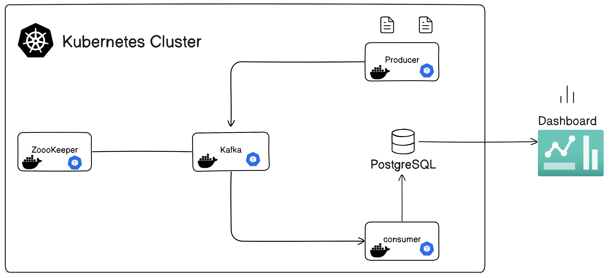

**Microservice-based Data Pipeline with Kafka, Spark, and Metabase**

## Overview

This repository contains a microservice-based data pipeline that uses Apache Kafka, Apache Spark, and Metabase for data ingestion, processing, and visualization. The pipeline is designed to efficiently handle streaming data, process it using Spark, and create interactive dashboards for data visualization using Metabase.

## Architecture


## Setup and Installation

### Prerequisites

- minikube /kubectl 
- docker 


### Instructions

1. Clone the repository:

   ```
   git clone https://github.com/phaneesh707/microservice-based-datapipeline
   cd microservice-based-datapipeline
   ```
2. Just run all the script files in each of the folder 
   ```
    ./script_file_name.sh
   ```

## Usage

1. Create kafka topic & update it in producer , consumer file
    ```
    kubectl exec POD_NAME -- kafka-topics.sh --create --topic TOPIC-NAME --bootstrap-server kafka-svc:9092 --partitions 1  --replication-factor 1
    ```
    - to list all the topics created 
    ```
    kubectl exec POD_NAME -- kafka-topics.sh --list --bootstrap-server kafka-svc:9092
    ```

2. Enter into to postgres pod and create a DB and table and update the table name in consumer.py
    ```
    psql -u USER user
    CREATE DATABASE DB-NAME
    # create table 
    ```

3. Enter into producers pod  & run producer file
    ```
    python producer.py
    ```

4. Enter into consumer pod & run the follwowing command
    ```
    spark-submit --packages org.apache.spark:spark-sql-kafka-0-10_2.12:3.3.0 consumer.py
    ```
    - now you can see the data being processed and written to database

5. Run 
    ```
    minikube tunnel
    ```
    - this will make the dashboard available to localhost

6. Get the IP of the metabase pod 
    ```
    kubectl get svc
    ```
    - copy the Ip of the 'metabase-service' and paste it in the browser 

7. Ta-da! now you can access you dash-borad and get the analytics of your data


## Few useful commands 

1. Enter into pod
    ```
    kubectl exec -it POD-NAME -- /bin/bash
    ```

2. Incase of errors to check logs of pod
    ```
    kubectl logs POD-NAME
    ```

3. To describe pod
    ```
    kubectl describe pod POD-NAME
    ```

4. To get all the pods/services/deployments

    ```
    kubectl get pods/services/deployments
    ```